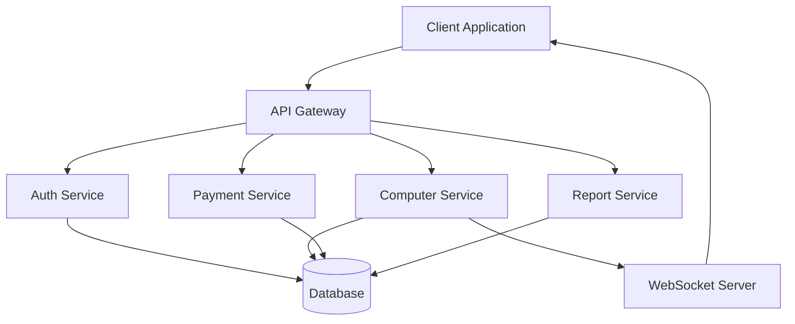

# System Architecture

## High-Level Overview

## Component Architecture

### Frontend
- **React + TypeScript**
- **State Management**: Redux Toolkit
- **API Client**: Axios + React Query
- **UI Framework**: Material-UI
- **Real-time**: WebSocket

### Backend
- **API Gateway**: Express.js
- **Services**: Node.js Microservices
- **Database**: PostgreSQL
- **Cache**: Redis
- **Message Queue**: RabbitMQ

## Security Architecture

### Authentication Flow
1. User credentials validation
2. JWT token generation
3. Refresh token rotation
4. Session management

### Data Protection
- **In Transit**: TLS 1.3
- **At Rest**: AES-256
- **Database**: Row-level encryption
- **Backups**: Encrypted backups

## Scalability

### Horizontal Scaling
- Load balancer configuration
- Service replication
- Database sharding

### Caching Strategy
- API response caching
- Database query caching
- Static asset caching 